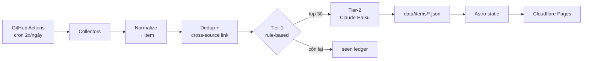

# ai-radar

Gom **paper, model release, tin ra mắt và tooling AI** về một feed duy nhất mỗi ngày — có lọc, có gộp trùng giữa các nguồn, và tóm tắt tiếng Việt.

Mỗi ngày có hàng trăm paper và model mới ra. Vấn đề không phải là tìm chúng ở đâu, mà là **lọc ra 30 thứ đáng đọc** và gom các mảnh rời rạc của cùng một sự kiện lại với nhau.

> 🚧 Đang phát triển — hiện ở mốc M1 (4 nguồn, gộp chéo nguồn, xếp hạng tier-1).

## Điểm khác biệt

Cùng một sự kiện thường xuất hiện ở 5 nơi: paper trên arXiv, model trên Hugging Face, repo trên GitHub, bài blog của lab, và post trên Reddit. Các công cụ hiện có hiển thị chúng thành 5 dòng riêng biệt. `ai-radar` gộp thành **một mục có 5 đường dẫn**.

## Kiến trúc



Không có server, không có database. Dữ liệu là file JSON trong git — nghĩa là pipeline **replay được** (chạy lại thuật toán xếp hạng trên toàn bộ lịch sử mà không cần fetch lại), debug bằng `cat`, và rollback bằng `git revert`.

Feed có hạn ngạch theo loại. Xếp thuần theo điểm thì model chiếm 26/30 chỗ, vì
model có tới ba tín hiệu đếm được (trending/downloads/likes) trong khi paper chỉ
có upvotes và tin blog thì không có tín hiệu nào.

Lý do đằng sau từng quyết định: [`docs/ARCHITECTURE.md`](docs/ARCHITECTURE.md).

## Nguồn dữ liệu

| Nguồn | Loại | Trạng thái |
|---|---|---|
| HF Daily Papers | paper | ✅ |
| arXiv RSS (5 category) | paper | ✅ |
| HF Models | model | ✅ |
| Blog RSS 8 lab | tin ra mắt | ✅ |
| OpenRouter Models | model closed-source | M4 |
| GitHub Search | repo | M4 |
| MCP Registry | tooling | M4 |
| Hacker News / Reddit | tín hiệu độ nóng | M4 |

Anthropic, Meta AI, Mistral và DeepSeek **không publish RSS** ở path thông thường
(đã dò 2026-08-01), nên sẽ phủ gián tiếp qua HN/Reddit ở M4.

Chỉ dùng API chính thức và RSS — không scrape.

> **Ghi chú về arXiv:** dự án cố tình chỉ dùng **RSS** (`rss.arxiv.org`), không dùng Query API. Từ 02/2026, Query API trả HTTP 429 liên tục kể cả khi tuân thủ đúng giới hạn 1 request/3 giây, và đến giữa 06/2026 vẫn chưa có giải pháp. RSS chỉ tốn 5 request/ngày và đã chứa đủ title, abstract, tác giả, DOI.

## Chạy thử

```bash
python3 -m venv .venv && source .venv/bin/activate
pip install -e ".[dev]"

python -m ai_radar --date 2026-07-31 --dry-run   # không ghi gì
python -m ai_radar                                # thu thập hôm nay
```

```
2026-07-31  fetched=116  new=30  gộp=0  trùng=0
  [ok ] hf_papers       0.45s  38 item
  [ok ] arxiv           0.69s  0 item      # rỗng T7/CN — feed tự khai <skipDays>
  [ok ] hf_models       0.45s  42 item
  [ok ] blogs           6.62s  36 item
```

`--explain` in bảng phân rã điểm để hiểu vì sao một mục lên hạng:

```
99.7  deepseek-ai/DeepSeek-V4-Flash-0731   hf_trending=+43.0  hf_likes=+21.7
                                           known_org=+10.0    age_decay=-2.3
```

## Phát triển

```bash
pytest        # test chạy offline, dùng response HTTP đã ghi lại
ruff check .
mypy
```

Thêm một nguồn mới = viết một class kế thừa `Collector` rồi đăng ký vào `collectors/REGISTRY`. Không cần đụng vào pipeline.

Mọi hằng số chỉnh được đều nằm trong `config/*.yaml`, không hardcode: danh sách
feed, ngưỡng lọc, trọng số scoring, hạn ngạch từng loại.

Test đánh dấu `live` chạm mạng thật và bị bỏ qua mặc định — dùng để bắt sai lệch
giữa tài liệu và thực tế của arXiv RSS:

```bash
pytest -m live
```

## Lộ trình

- [x] **M0** — schema, `Collector` base, HF Daily Papers, ghi JSON
- [x] **M1** — arXiv RSS + HF Models + blog RSS, dedup chéo nguồn 6 tầng, tier-1 scoring
- [ ] **M2** — tóm tắt tiếng Việt (Claude Haiku), web Astro, deploy
- [ ] **M3** — cron GitHub Actions, run manifest, xử lý lỗi
- [ ] **M4** — thêm GitHub, MCP Registry, OpenRouter, HN, Reddit
- [ ] **M5** — CI, ADR, hoàn thiện tài liệu

## Giấy phép

MIT. Nội dung hiển thị thuộc về nguồn gốc — dự án chỉ hiển thị tiêu đề, đường dẫn và tóm tắt tự sinh, không sao chép lại nội dung gốc.
