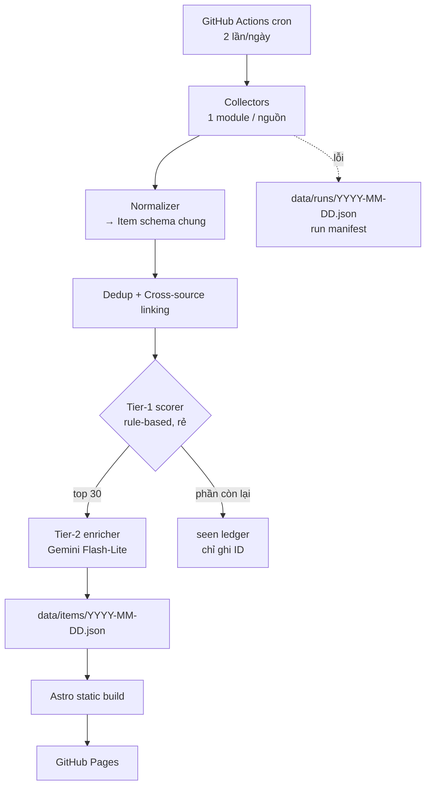

# AI Radar — Khảo sát kiến trúc & vấn đề kỹ thuật

> Tài liệu chuẩn bị trước khi code. Tên `ai-radar` là placeholder.
> Ngày khảo sát: 2026-08-01. Mọi endpoint dưới đây đã được kiểm chứng thực tế tại thời điểm này.

---

## 1. Mục tiêu & phạm vi

Gom **paper + model release + tin ra mắt + hệ sinh thái tooling (MCP/agent/skill)** của mảng AI về một feed duy nhất, có lọc và tóm tắt tiếng Việt.

**Ràng buộc chủ đạo:**

| Ràng buộc | Hệ quả thiết kế |
|---|---|
| Dùng cá nhân, không multi-user | Không cần auth, không cần DB server, không cần API layer |
| Là portfolio project (pin GitHub) | Cần README tốt, test, CI, ADR, code sạch — chất lượng kỹ thuật là một phần deliverable |
| Chạy một mình, không có thời gian ops | Không server, không DB cần backup, pipeline phải tự phục hồi khi một nguồn chết |
| Chi phí ≈ 0 | Static hosting + GitHub Actions + LLM tier rẻ |

**Không làm (scope creep cần chặn từ đầu):** đăng nhập người dùng, thông báo email, mobile app, search engine full-text, API công khai, đa ngôn ngữ ngoài VI/EN.

---

## 2. Khảo sát nguồn dữ liệu

### 2.1 Bảng trạng thái (đã verify 2026-08-01)

| Nguồn | Endpoint | Auth | Trạng thái | Ghi chú |
|---|---|---|---|---|
| **HF Daily Papers** | `GET huggingface.co/api/daily_papers?date=YYYY-MM-DD` | Không | ✅ Sống | Nguồn curate tốt nhất. Có `upvotes`, `githubRepo`, `submittedBy`, `numComments` |
| **HF Models** | `GET huggingface.co/api/models?sort=createdAt&direction=-1&limit=100` | Không (token → limit cao hơn) | ✅ Sống | Cũng hỗ trợ `sort=trending_score`. Phân trang qua `Link` header, `limit` tối đa 1000 |
| **OpenRouter Models** | `GET openrouter.ai/api/v1/models` | Không | ✅ Sống | Bắt model closed-source. Có `created` (unix), `pricing`, `context_length`, và cả `benchmarks` |
| **arXiv RSS** | `GET rss.arxiv.org/rss/{category}` | Không | ✅ Sống | **Đường duy nhất nên dùng** — xem 2.2 |
| **arXiv Query API** | `export.arxiv.org/api/query` | Không | ⚠️ Rủi ro cao | 429 liên tục từ 02/2026, chưa có giải pháp — xem 2.2 |
| **GitHub Search** | `GET api.github.com/search/repositories` | Token (nên có) | ✅ Sống | 30 req/phút khi có auth, 10 req/phút khi không |
| **MCP Registry** | `GET registry.modelcontextprotocol.io/v0/servers` | Không | ✅ Sống | Phân trang `cursor` + `limit` |
| **Company blogs RSS** | RSS từng lab | Không | ✅ Sống | OpenAI, Anthropic, DeepMind, Meta AI, Mistral, Qwen, DeepSeek, Cohere |
| **Hacker News** | Algolia API `hn.algolia.com/api/v1/search` | Không | ✅ Sống | Lọc theo `points`, dùng làm tín hiệu độ nóng |
| **Reddit** | `reddit.com/r/{sub}/new.json` | Token (khuyến nghị) | ✅ Sống | r/LocalLLaMA, r/MachineLearning |
| **Semantic Scholar** | `api.semanticscholar.org/graph/v1` | Không (key → limit cao) | ✅ Sống | 100 req / 5 phút khi không key |
| **OpenAlex** | `api.openalex.org` | ⚠️ **Bắt buộc API key từ 13/02/2026** | ⚠️ Đã đổi | Bỏ polite pool, chuyển sang credit-based. Chỉ dùng làm enrichment tùy chọn |
| **Papers with Code** | — | — | ❌ Chết | Đóng cửa 24/07/2025. Data cũ còn ở `github.com/paperswithcode/paperswithcode-data` |
| **Upwork / X (Twitter)** | — | — | ❌ Không dùng | Chặn scraping, chi phí duy trì quá cao |

### 2.2 Vấn đề arXiv — ràng buộc kiến trúc quan trọng nhất

**Tình hình:** từ khoảng 25–26/02/2026, arXiv Query API trả HTTP 429 liên tục kể cả khi user tuân thủ đúng giới hạn 1 request / 3 giây. Nhân viên arXiv (Brian Maltzan) xác nhận có thay đổi phía họ. Tính đến giữa 06/2026 thread vẫn chưa có kết luận, chưa có tier throughput cao chính thức.

**Kết luận thiết kế:**

1. **Discovery hàng ngày chỉ dùng RSS**, không dùng Query API.
   `https://rss.arxiv.org/rss/cs.CL`, `cs.CV`, `cs.LG`, `cs.AI`, `eess.AS`
   → 5 request/ngày. Không có cách nào chạm giới hạn.
   RSS entry đã có: title, abstract (trong `description`), authors (`dc:creator`), arXiv ID, category, DOI, journal ref, license.
   **Đủ dùng cho 95% nhu cầu — không cần Query API để hiển thị feed.**

2. Nếu về sau cần enrichment (citation count, tác giả đầy đủ, related papers): dùng **Semantic Scholar**, không dùng arXiv Query API.

3. Nếu buộc phải gọi Query API: dùng **GET, không dùng POST** (POST bypass cache Fastly nên dính rate limit nhanh hơn), throttle ≥ 3s, exponential backoff khi gặp 429/503, và giới hạn ở nhóm đã lọc (< 50 item/ngày).

4. **arXiv nghỉ cuối tuần và ngày lễ** — RSS trả feed rỗng. Pipeline phải coi feed rỗng là hợp lệ, không phải lỗi.

### 2.3 Vấn đề OpenAlex

Từ 13/02/2026, OpenAlex bỏ polite pool, **bắt buộc API key**, và chuyển từ giới hạn theo số lệnh gọi sang giới hạn theo credit. Nghĩa là mọi hướng dẫn cũ ("chỉ cần thêm `mailto=`") đã lỗi thời.

→ Xếp OpenAlex vào nhóm **enrichment tùy chọn**, có key thì dùng, không có thì bỏ qua. Không để bất kỳ tính năng cốt lõi nào phụ thuộc vào nó.

---

## 3. Kiến trúc tổng thể



### 3.1 Vì sao static + git thay vì server + DB

| Tiêu chí | Static + git (chọn) | Server + Postgres |
|---|---|---|
| Chi phí | 0đ | 0đ ban đầu, free tier hay hết hạn |
| Ops | Không có gì để sập | Cần backup, migration, monitoring |
| Debug | `cat` file JSON là xong | Phải query DB |
| Rollback | `git revert` | Cần script khôi phục |
| Replay pipeline | Chạy lại ranking trên toàn bộ lịch sử, không cần fetch lại | Được, nhưng phức tạp hơn |
| Điểm portfolio | Cao — thể hiện hiểu biết về trade-off | Trung bình — dễ bị coi là over-engineering |
| Giới hạn | Không query phức tạp, không realtime | Linh hoạt hơn |

Với 50–100 item/ngày và một người dùng, không có lý do nào cần database server.

### 3.2 Layout dữ liệu trong repo

```
data/
  seen/2026-08.txt              # ledger dedup, plaintext append-only, ~30 byte/dòng
  items/2026-08-01.json         # item đã qua tier-1 + đã enrich
  runs/2026-08-01.json          # manifest: đếm theo nguồn, thời lượng, lỗi
  quarantine/2026-08-01.jsonl   # record không parse được, để điều tra sau
```

**Vì sao không commit toàn bộ raw:** arXiv một mình đã 400–700 paper/ngày. Commit hết ≈ 220MB/năm → git phình. Chỉ commit item vượt tier-1 (~50–100/ngày ≈ 36MB/năm) + ledger ID (~6.5MB/năm). Chấp nhận được.

**Vì sao ledger là plaintext chứ không phải SQLite:** file binary thay đổi mỗi ngày làm git phình rất nhanh. File text append-only cho diff nhỏ xíu.

---

## 4. Data model

```python
Item = {
  "id":            str,          # sha256(canonical_key)[:16] — ổn định giữa các lần chạy
  "kind":          "paper" | "model" | "release" | "repo" | "tool",
  "title":         str,
  "summary_en":    str | None,   # abstract / description gốc
  "summary_vi":    str | None,   # LLM sinh, 2–3 câu
  "topics":        [str],        # llm, cv, speech, agent, rag, mcp, multimodal, robotics, infra, eval
  "links":         [{"source": str, "url": str, "external_id": str}],   # ← cross-source linking ở đây
  "actors":        [str],        # tác giả hoặc tổ chức
  "published_at":  datetime,
  "first_seen_at": datetime,
  "signals": {
      "hf_upvotes": int, "hf_downloads": int, "hf_trending_score": float,
      "is_daily_paper": bool, "github_stars": int, "github_stars_delta": int,
      "hn_points": int, "reddit_score": int, "has_weights": bool, "has_code": bool
  },
  "score":           float,
  "score_breakdown": {str: float},   # để debug và hiển thị minh bạch
}
```

`links` là mảng chứ không phải string — đây chính là chỗ tạo ra giá trị: một sự kiện xuất hiện ở 5 nguồn được gộp thành **một item có 5 link**, không phải 5 item trùng nhau.

---

## 5. Dedup & cross-source linking

Đây là phần khó nhất về mặt kỹ thuật và cũng là điểm khác biệt lớn nhất so với các web hiện có.

### Thứ tự khóa gộp (dừng ở khóa đầu tiên khớp)

1. **arXiv ID** đã chuẩn hóa (bỏ hậu tố version: `2508.01234v3` → `2508.01234`)
2. **DOI** đã chuẩn hóa (lowercase, bỏ prefix `https://doi.org/`)
3. **GitHub `full_name`** (`owner/repo`, lowercase)
4. **HF repo id** (`org/model`, lowercase)
5. **URL chuẩn hóa** (bỏ query params tracking, bỏ trailing slash, bỏ `www.`)
6. **Title fuzzy** — chỉ áp dụng trong cửa sổ ±7 ngày:
   chuẩn hóa (lowercase, bỏ dấu câu, bỏ stopword) → token-set ratio ≥ 0.90

Bước 6 phải giới hạn cửa sổ thời gian, nếu không sẽ vừa chậm (O(n²)) vừa gộp nhầm các paper có tên na ná nhau qua nhiều năm.

### Bẫy đã lường trước

- **arXiv version**: cùng paper, v1 và v3 khác ID → phải strip version.
- **Preprint vs published**: cùng nội dung, arXiv ID và DOI khác nhau → chỉ khớp được qua title fuzzy.
- **Model quantize**: `TheBloke/Llama-3-70B-GGUF` vs `meta-llama/Llama-3-70B` là hai item khác nhau, **không được gộp** — nhưng nên link tham chiếu.
- **Mirror repo**: nhiều repo GitHub trỏ cùng một paper → gộp về paper, giữ nhiều link.

---

## 6. Pipeline lọc & xếp hạng

### Tier 1 — rule-based, chạy trên toàn bộ (~600 item/ngày, chi phí 0)

```
score = w1·log1p(hf_upvotes)
      + w2·is_daily_paper                    # tín hiệu mạnh nhất
      + w3·log1p(github_stars_delta_7d)
      + w4·known_org_bonus                   # OpenAI, Anthropic, DeepMind, Meta, Qwen, DeepSeek, Mistral, AI2...
      + w5·has_weights + w6·has_code
      + w7·topic_match                       # khớp chủ đề bạn quan tâm
      + w8·log1p(hn_points)
      - w9·age_decay
```

Lấy top ~50. Trọng số để trong `config/weights.yaml`, không hardcode — đây là chỗ bạn sẽ chỉnh nhiều nhất.

### Tier 2 — LLM, chỉ chạy trên ~30 item đã lọc

Nhà cung cấp **cắm rút được** (`Enricher` interface). Mặc định `NullEnricher`:
không cần key nào, feed vẫn chạy, chỉ thiếu tóm tắt. Đổi nhà cung cấp = sửa một
dòng `enrich.provider` trong `config/sources.yaml`.

Đang dùng: **Gemini 2.5 Flash-Lite** — free tier thật, không cần thẻ tín dụng,
1.000 request/ngày so với nhu cầu ~40.

| Lựa chọn | Hạn mức miễn phí | Thẻ |
|---|---|---|
| Gemini Flash-Lite *(đang dùng)* | 15 req/phút, 1.000 req/ngày | Không |
| Groq (Llama 3.3 70B) | 30 req/phút, 14.400 req/ngày | Không |
| OpenRouter `:free` | 20 req/phút, **50 req/ngày** | Không |
| Claude Haiku 4.5 | Không có free tier, ~$1.17/tháng | Có |

API dùng `/v1beta/interactions` (`:generateContent` đã bị Google đánh dấu
legacy), header `Api-Revision`, structured output qua `response_format`.
Tên model để trong config vì Google đổi thế hệ nhanh — `--check-enrich` liệt kê
model mà key hiện tại thực sự dùng được.

Output có cấu trúc (structured outputs, không parse text thô):
- `summary_vi`: 2–3 câu tiếng Việt
- `topics`: mảng tag từ enum cố định
- `why_it_matters`: 1 câu — đây mới là thứ bạn thực sự đọc

### Chi phí

**0đ** với Gemini free tier: ~40 request/ngày so với hạn mức 1.000. Nếu sau này
chuyển sang Claude Haiku 4.5 ($1/$5 per triệu token) thì khoảng $1.17/tháng
(≈30.000đ) khi dùng Batch API giảm 50%.

---

## 7. Xử lý lỗi & vận hành

### Nguyên tắc: mỗi nguồn độc lập hoàn toàn

```python
for source in SOURCES:
    try:
        items = source.fetch()
        manifest.record(source.name, ok=True, count=len(items))
    except Exception as e:
        manifest.record(source.name, ok=False, error=repr(e))
        continue          # KHÔNG để một nguồn chết làm đổ cả pipeline
```

### Bảng failure mode

| Sự cố | Xử lý |
|---|---|
| Nguồn trả 5xx / timeout | Retry 3 lần, exponential backoff + jitter, rồi bỏ qua |
| Rate limit (429) | Tôn trọng header `Retry-After`; token bucket riêng cho từng nguồn |
| Schema đổi (thiếu field) | Validate bằng Pydantic → record hỏng đẩy vào `quarantine/`, không crash |
| arXiv trả feed rỗng (cuối tuần) | Coi là hợp lệ, không cảnh báo |
| LLM lỗi | Retry; nếu vẫn lỗi → item vẫn hiển thị, chỉ thiếu `summary_vi` |
| Chạy lặp cùng ngày | Idempotent: `seen` ledger chặn ghi trùng |
| Cả pipeline chết | Actions gửi thông báo; site vẫn hiển thị dữ liệu ngày cũ (static nên không sập theo) |

### Observability

`data/runs/YYYY-MM-DD.json` ghi lại: số item mỗi nguồn, thời lượng, danh sách lỗi, số item bị dedup, số item qua tier-1, chi phí LLM ước tính. Đây vừa là công cụ debug vừa là điểm cộng portfolio.

---

## 8. Tech stack

| Tầng | Chọn | Lý do |
|---|---|---|
| Collector | **Python 3.13** | `feedparser` cho RSS, `httpx` cho HTTP async, `pydantic` cho validation — hệ sinh thái parsing tốt nhất |
| Validation | **Pydantic v2** | Bắt schema drift ngay tại biên |
| Lưu trữ | **JSON files trong git** | Xem 3.1 |
| LLM | **Gemini 2.5 Flash-Lite** (cắm rút được) | Xem 6 |
| Site | **Astro** (static) | Content-first, build ra HTML thuần, JS tối thiểu, nhanh |
| Hosting | **GitHub Pages** | Free, không cần đăng ký thêm dịch vụ nào, deploy thẳng từ Actions |
| CI/cron | **GitHub Actions** | **Miễn phí không giới hạn phút với public repo** |
| Lint/format | **ruff** | Nhanh, thay được cả black + flake8 + isort |
| Type check | **mypy** (strict) | Điểm portfolio |
| Test | **pytest** + **respx** | respx mock HTTP → test không cần mạng, chạy được trong CI |

Node 22 và Python 3.13 đều đã có sẵn trên máy.

---

## 9. Cấu trúc repo (chuẩn portfolio)

```
ai-radar/
├── README.md                   # kiến trúc + screenshot + bảng nguồn + "vì sao"
├── LICENSE
├── pyproject.toml              # ruff + mypy + pytest config
├── config/
│   ├── sources.yaml            # cấu hình từng nguồn
│   └── weights.yaml            # trọng số scoring
├── src/ai_radar/
│   ├── collectors/             # 1 file/nguồn, cùng interface
│   │   ├── base.py             # abstract Collector
│   │   ├── arxiv_rss.py
│   │   ├── hf_papers.py
│   │   ├── hf_models.py
│   │   ├── openrouter.py
│   │   ├── github_search.py
│   │   ├── mcp_registry.py
│   │   └── blogs_rss.py
│   ├── models.py               # Pydantic Item schema
│   ├── dedup.py                # cross-source linking
│   ├── scoring.py              # tier-1
│   ├── enrich.py               # tier-2 (Claude)
│   ├── store.py                # đọc/ghi data/
│   └── pipeline.py             # orchestration
├── tests/
│   ├── fixtures/               # response HTTP đã ghi lại
│   └── test_*.py
├── web/                        # Astro
├── docs/
│   ├── ARCHITECTURE.md         # file này
│   └── adr/                    # 0001-static-over-server.md, 0002-arxiv-rss-only.md, ...
├── data/
└── .github/workflows/
    ├── ci.yml                  # lint + typecheck + test trên mỗi PR
    └── collect.yml             # cron 2 lần/ngày
```

Điểm portfolio nằm ở: interface `Collector` thống nhất (dễ thêm nguồn), test không cần mạng, ADR ghi lại lý do quyết định, run manifest cho observability.

---

## 10. Lộ trình

| Giai đoạn | Nội dung | Tiêu chí hoàn thành |
|---|---|---|
| **M0** | Schema + `Collector` base + 1 nguồn (HF Daily Papers) + ghi JSON | Chạy `python -m ai_radar` ra được file `data/items/*.json` |
| **M1** | Thêm arXiv RSS + HF Models + blog RSS. Dedup + tier-1 scoring | 3 nguồn chạy song song, dedup hoạt động |
| **M2** | Tier-2 (Gemini) + site Astro + deploy GitHub Pages | Web chạy thật, có tóm tắt tiếng Việt |
| **M3** | GitHub Actions cron + run manifest + xử lý lỗi | Tự chạy 2 lần/ngày, một nguồn chết không làm đổ pipeline |
| **M4** | Thêm GitHub Search, MCP Registry, OpenRouter, HN, Reddit | Đủ 8+ nguồn |
| **M5** | Test + CI + README + ADR | Đủ chất lượng để pin lên profile |

M0–M2 là bản chạy được. **Ưu tiên tuyệt đối đưa M2 lên sóng trước khi làm bất cứ thứ gì khác** — rủi ro lớn nhất của dự án này là bỏ dở giữa chừng, không phải rủi ro kỹ thuật.

---

## 11. Rủi ro

| Rủi ro | Mức | Giảm thiểu |
|---|---|---|
| **Bỏ dở giữa chừng** | **Cao** | Cắt scope M0–M2 thật nhỏ; có bản chạy được trong ~1 tuần |
| arXiv siết thêm rate limit | Trung bình | Đã chỉ dùng RSS (5 req/ngày); nếu RSS cũng siết → dùng HF Daily Papers + Semantic Scholar |
| Nguồn đổi schema | Trung bình | Pydantic validate + quarantine + run manifest cảnh báo |
| Tier-1 lọc sai (bỏ sót đồ hay) | Trung bình | Trọng số để trong config, `score_breakdown` hiển thị được để soi; giữ ledger đầy đủ để replay |
| OpenAlex đổi chính sách lần nữa | Thấp | Đã xếp là optional, không có tính năng nào phụ thuộc |
| Vấn đề bản quyền nội dung | Thấp | Chỉ hiển thị tiêu đề + link gốc + tóm tắt tự sinh; **không mirror abstract/full text**; ghi rõ nguồn |
| Chi phí LLM vượt dự kiến | Thấp | Tier-1 chặn cứng số item vào tier-2; log chi phí mỗi lần chạy |

---

## 12. Quyết định cần chốt trước khi code

1. **Tên project** (ảnh hưởng repo name, domain) — `ai-radar`, `ai-pulse`, `nhipai`, …
2. **Ngôn ngữ hiển thị**: chỉ VI, hay VI + giữ title EN gốc (khuyến nghị: giữ title EN, tóm tắt VI)
3. **Tần suất cron**: 1 hay 2 lần/ngày (khuyến nghị: 2 — sáng và tối, bắt kịp tin từ US timezone)
4. **Số item/ngày mục tiêu**: 30 hay 50 (khuyến nghị: 30 — đọc hết được mới có giá trị)
